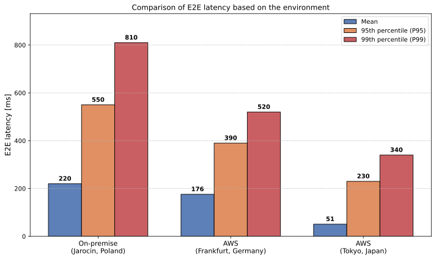

# Real-Time Cryptocurrency Pipeline

A pipeline ingesting cryptocurrency price data from **Binance**, sending it to Kafka, generating alerts using **Spark Structured Streaming**, saving them in Redis and displaying them in Streamlit. It also has a strong observability layer (Prometheus & Grafana), measuring **E2E latency, Kafka lag, CPU usage** and [other metrics](#metrics-collection).

The project was developed as part of a bachelor's thesis, defended at Warsaw University of Technology. The title of the thesis is: **Real-time Data Processing: A Comparison of On-Premise and AWS Infrastructure**. Experiments and their results are presented in the [Experiments](#experiments) section. 

## Infrastructure diagram


## Key components

### Core layer

- **Kafka**: serves as a queue and a buffer between the producer and the consumers
- **Spark Structured Streaming**: enables easy window aggregation and handling late data using watermarking
- **Redis**: as an in-memory database, it provides extremely fast write and read speeds
- **Streamlit**: is used to visualize live prices and generated alerts
- **Docker**: is used to orchestrate the whole system using Docker Compose

### Monitoring layer

- **Prometheus**: serves as a central metric collection database
- **Grafana**: is used to visualize data collected using Prometheus
- **Clock Skew Monitor**: estimates time difference between the host server and the Binance server to assess its impact on other metrics

## Metrics collection

### Prices processing metrics

- **E2E latency** (mean, 95th percentile and 99th percentile): defined as system latency + network latency
- **Consumer throughput**
- **Kafka consumer lag** ("prices" topic)
- **System latency**
- **Network latency**
- **System latency share**

### Alert generation metrics

- **Micro-batch processing time** (mean, 95th percentile and 99th percentile)
- **Spark input rate**
- **Spark output rate**

### Infrastructure metrics (measured for each Docker container separately)

- **CPU usage**
- **RAM utilization**
- **Network data received**
- **Network data sent**
- **Disk read throughput**
- **Disk write throughput**

### Additional metrics

- **API response time**
- **Estimated clock skew**

## Experiments

Experiments were conducted as part of the bachelor's thesis defended at Warsaw University of Technology, titled **Real-time Data Processing: A Comparison of On-Premise and AWS Infrastructure**.

Three environments were chosen: a local setup (Jarocin, Poland) and two AWS cloud regions: Frankfurt (eu-central-1) and Tokyo (ap-northeast-1). All metrics defined in the [Metrics collection](#metrics-collection) section were collected for each environment.

### Experiment results



The results indicate the critical importance of infrastructure location for trading systems. The Tokyo environment achieved the lowest average total latency (51 ms), compared to Frankfurt (176 ms) and the local environment (220 ms). 

## Technical highlights

*   **Handling late data:** Implemented Spark watermarking to ensure windowed aggregations remain accurate even with network jitter.
*   **Latency optimization:** Tuned Kafka producers and consumers (`linger_ms`, `batch_size`) to achieve low end-to-end latency.
*   **Clock drift correction:** Solved the "distributed time" problem by building a custom monitor to account for system clock differences when measuring global latency.
*   **Production-ready observability:** Every stage of the pipeline is metered, from network travel time to micro-batch processing duration.

## Running the program

### Prerequisites

- Docker & Docker Compose

### Installation

1.  Clone the repository:
    ```bash
    git clone https://github.com/kacperfin/streaming-data-pipeline
    cd streaming-data-pipeline
    ```
2.  Set up environment variables:
    ```bash
    cp .env.example .env
    # In .env you can set symbols (trading pairs) and the price change alert threshold
    ```
### Usage

1.  Launch the stack:
    ```bash
    docker compose up -d
    ```
2.  Access the services:
    *   **Streamlit dashboard:** `http://localhost:8501`
    *   **Grafana dashboards:** `http://localhost:3000` (login: `admin`, password: `admin`)
    *   **Prometheus:** `http://localhost:9090`
    *   **Spark UI:** `http://localhost:4040`